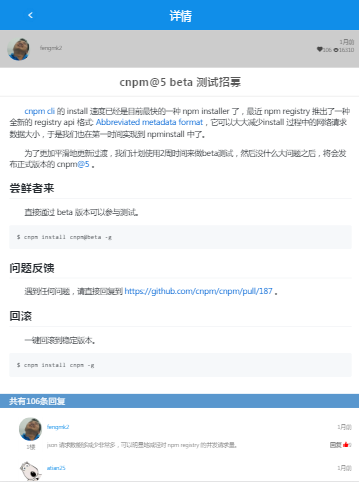
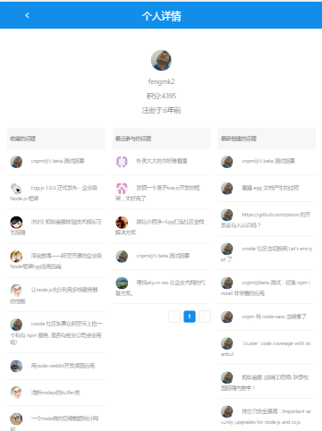

# dva-cnode

用dva数据交互框架写具有登录功能的cnode项目。

  
  

## 为什么要用dva ?

经过一段时间的自学或培训，大家应该都能理解 redux 的概念，并认可这种数据流的控制可以让应用更可控，以及让逻辑更清晰。

但随之而来通常会有这样的疑问：概念太多，并且 reducer, saga, action 都是分离的（分文件）。

这带来的问题是：

编辑成本高，需要在 reducer, saga, action 之间来回切换
不便于组织业务模型 (或者叫 domain model) 。比如我们写了一个 userlist 之后，要写一个 productlist，需要复制很多文件。
还有一些其他的：

>* saga 书写太复杂，每监听一个 action 都需要走 fork -> watcher -> worker 的流程
>* entry 书写麻烦

我个人认为dva相对于redux开发起来要方便很多。比如你不必单独的去创建action.js文件。dva是直接在dispatch时写清楚action就行了。它把侧重点放在了
model（类似于reducer但比它做的事情要多）文件里面，便于数据逻辑的统一维护。特别是对于异步action,dva处理起来要轻松很多。你不必去在意请求时
isFetching的状态，不需要每个异步请求都要派发三个action，因为dva内置loading插件，它会根据请求状态自动更新，从而让你专注于请求逻辑就行了。
...
而 dva 正是用于解决这些问题。
## Getting Started
Install dependencies.

```bash
$ npm install
```

Start server.

```bash
$ npm start
```

If success, app will be open in your default browser automatically.
